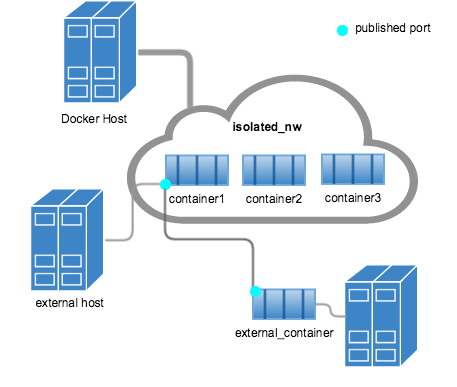
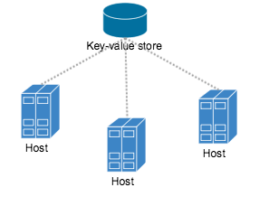
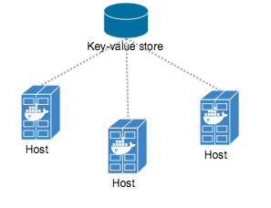
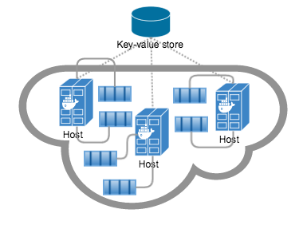

# 容器网络

使用Docker网络功能可以帮助我们在建设 web 应用时保证一致和安全性。网络的定义就是为容器之间提供完全的独立性。因此对应用运行的网络控制是非常重要的。Docker容器网络功能正好给我们提供了这样的控制。下面主要会介绍Docker Engine原生发布的默认网络的特性，描述默认的网络类型以及如何自定义我们自己的网络，并且提供了关于如何在单机或者集群创建网络所需要的资源。

## bridge 默认网络

我们安装 Docker 后，它默认创建了三种网络，我们使用 docker network ls 命令来看下具体列表: 

```
$ docker network ls

NETWORK ID          NAME                DRIVER
7fca4eb8c647        bridge              bridge
9f904ee27bf5        none                null
cf03ee007fb4        host                host
```

从历史上看，这三个网络是 Docker 实现的一部分。当我们运行容器时我们可以使用 --net 标志指定要运行的网络时，这三种类型网络依然可用。 
名字为 bridge 的网络代表我们安装 Docker 主机上的名字为 docker0 的网络。默认情况下容器会使用此网络，除非我们执行 docker run --net=<NETWORK> 指定网络自定义的网络。我们可以在宿主主机上执行 ifconfig docker0 查看 docker0 网络配置信息。 

```
$ ifconfig

docker0   Link encap:Ethernet  HWaddr 02:42:47:bc:3a:eb
          inet addr:172.17.0.1  Bcast:0.0.0.0  Mask:255.255.0.0
          inet6 addr: fe80::42:47ff:febc:3aeb/64 Scope:Link
          UP BROADCAST RUNNING MULTICAST  MTU:9001  Metric:1
          RX packets:17 errors:0 dropped:0 overruns:0 frame:0
          TX packets:8 errors:0 dropped:0 overruns:0 carrier:0
          collisions:0 txqueuelen:0
```

none 的网络将容器添加到一个容器特定网络栈中。这样的容器缺少一个网络接口，附着到这样的容器上可以看到其网络栈内容如下： 

```
$ docker attach nonenetcontainer

root@0cb243cd1293:/# cat /etc/hosts
127.0.0.1	localhost
::1	localhost ip6-localhost ip6-loopback
fe00::0	ip6-localnet
ff00::0	ip6-mcastprefix
ff02::1	ip6-allnodes
ff02::2	ip6-allrouters
root@0cb243cd1293:/# ifconfig
lo        Link encap:Local Loopback
          inet addr:127.0.0.1  Mask:255.0.0.0
          inet6 addr: ::1/128 Scope:Host
          UP LOOPBACK RUNNING  MTU:65536  Metric:1
          RX packets:0 errors:0 dropped:0 overruns:0 frame:0
          TX packets:0 errors:0 dropped:0 overruns:0 carrier:0
          collisions:0 txqueuelen:0
          RX bytes:0 (0.0 B)  TX bytes:0 (0.0 B)

root@0cb243cd1293:/#
```

> 我们可以使用 ctrl+p + ctrl+q 快捷键来脱离正在运行中的容器而不影响容器运行。 

host 的网络将容器添加到了宿主的网络栈上，这样容器的网络配置信息与宿主主机的网络配置是一样的。 

bridge 网络是我们默认使用的网络，我们可以使用 docker network inspect bridge 查看它的详细信息。我们也可以自定义新的 bridge 驱动的网络，并且可以在我们不需要使用的时候删除掉自定义的网络，然而 bridge 名称的网络我们无法删除，它是 Docker 引擎安装时需要使用的。

值得一提的是在 bridge 驱动的网络正常仅用于单机内部使用，对于宿主以外的主机如果想要访问容器就需要通过 docker run -p 或者 -P 参数将需要访问的服务端口开放映射到宿主主机的网络端口，并且配置放开本地防火墙的拦截规则。这样外部主机就可以访问容器的服务了。具体如下图: 


  
bridge 网络比较适用于在单机运行相对较小的网络。对于比较大型的网络我们可以使用 overlay 网络来实现。

## overlay 网络 

Docker的 overlay 网络驱动器支持多宿主主机互联。这种支撑能力得益于 libnetwork 库，libnetwork 是一个基于 VXLAN 的 overlay 网络驱动器。

overlay 网络需要一个有效的 key-value 存储服务，目前 Docker 支持的有 Consul,、Etcd和ZooKeeper (分布式存储)。在创建 overlay 网络之前我们必须先安装并配置好我们指定的 key-value 存储服务，并且需要保证要接入网络的宿主主机和服务是可以通信的。示例如下图: 

  

每个接入 overlay 网络的宿主主机必须运行了 Docker 引擎实例，比较简便的做法是使用 Docker Machine 来完成。 
  
  

我们同时还需要开放如下几个端口服务：

Protocol | Port | Description
------------ | ------------- | -------------
udp  |  4789 | Data plane (VXLAN)
tcp/udp | 7946 | Control plane

对于key_value服务需要开放的端口需要查看所选择服务的厂商文档来确定了。

对于多台主机的管理，我们可以使用 Docker Swarm 来快速的把他们加入到一个集群中，这个集群中需要包含一个发现服务。
 
在创建 overlay 网络前，我们需要配置Docker的 daemon 的几个参数选项，具体内容如下: 

Option | Description
------------ | ------------- 
--cluster-store=PROVIDER://URL | Describes the location of the KV service.
--cluster-advertise=HOST_IP or HOST_IFACE:PORT | The IP address or interface of the HOST used for clustering.
--cluster-store-opt=KEY-VALUE | OPTIONS	Options such as TLS certificate or tuning 


执行如下命令在集群中的主机上创建一个 overlay 网络：

``` 
$ docker network create --driver overlay my-multi-host-network
```

这样一个跨多个主机的网络就创建完成了， overlay 网络为这些容器提供了一个完全隔离的环境。 
  
  

接下来，我们在每个宿主主机上就可以运行指定为使用overlay网络的容器了，执行命令为:

```
$ docker run -itd --net=my-multi-host-network busybox
```

一旦网络建立连接后，网络中的容器都可以互相访问，无论这个容器是否启动了。下图为我们最终创建的 overlay 网络结构。
 
 

## 自定义网络插件


我们可以使用Docker提供的插件基础设施来实现自己的网络驱动器，这样的一个插件就是一个运行在宿主主机上同 daemon 进程一样的进程。 
想了解关于如何编写网络驱动器参考下面两个站点：

1. Docker 引擎扩展
2. Docker 引擎网络插件

## Docker内嵌的DNS服务器

Docker的守护进程 daemon 运行了一个内嵌的DNS服务来为用户自定义网络上容器提供一个自动服务发现的功能。来自于容器的域名解析请求首先会被这个内嵌DNS服务器获取，如果它无法解析此域名就将这个请求转发给为配置给该容器的外部DNS服务器。 
