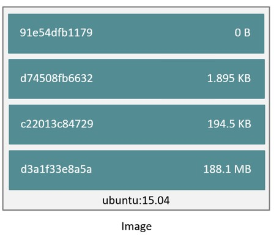
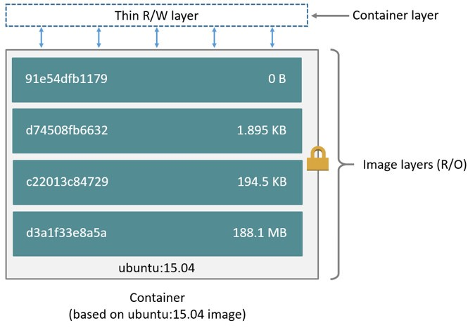
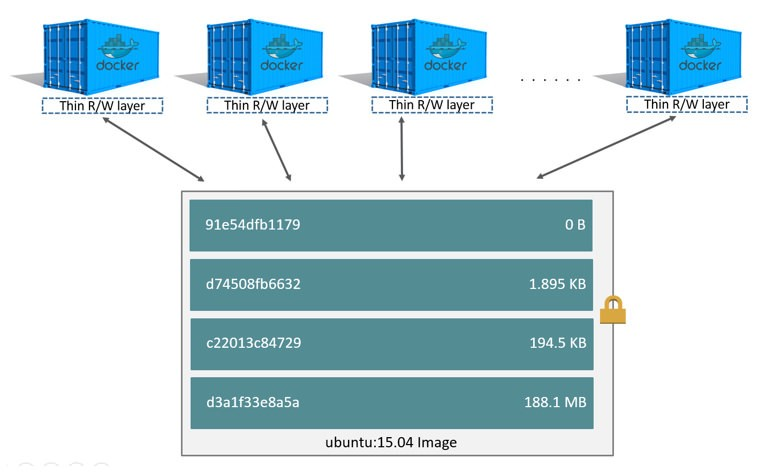
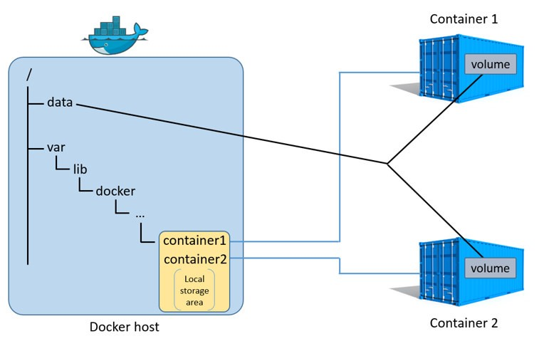
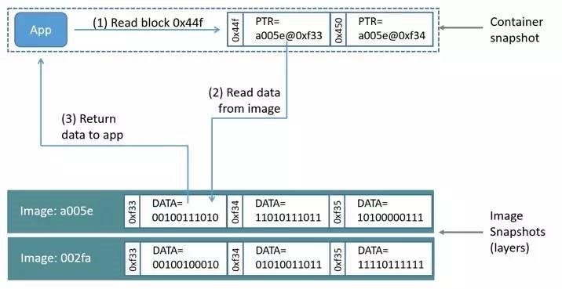
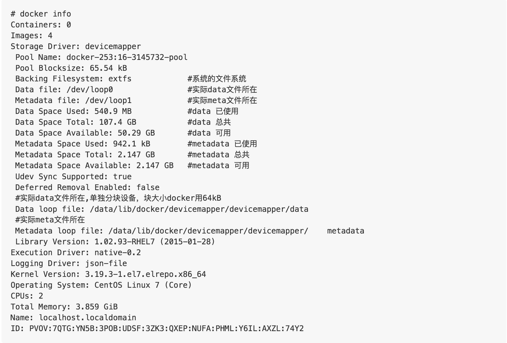
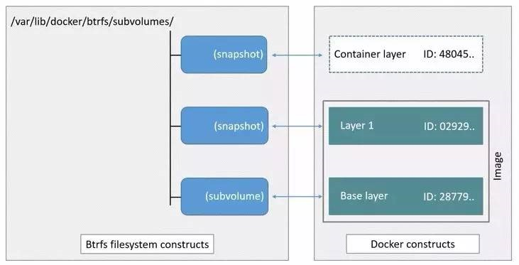
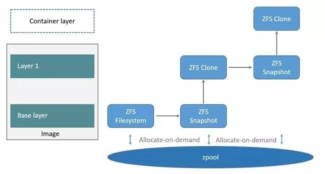

# 存储驱动

## 镜像，容器与存储驱动

> images，container，storage driver

### 镜像与层（Images and Layers）

以ubuntu15.04为例，由四个镜像层堆叠而成，而且每层都是只读的。存储驱动负责堆叠这些镜像层并提供统一视口（The Docker storage driver is responsible for stacking these layers and providing a single unified view.）
 
 

如下图所示，当创建一个容器时，会在原有的layer上添加一个新的，稀疏的，可读写的“容器层”，在容器上进行的所有读，写，删除文件的指令都会在容器层完成
 
 

### 容器与层（container and layer）

容器和镜像最大的不同就在于顶层可读写的容器层。所有在容器层进行的读写操作，在容器被删除后，数据将会删除，而底层的镜像层保持不变

如下图所示，用同一个 ubuntu15.04 镜像，启动多个 ubuntu15.04 容器，每个容器都有负责各自读写操作的“容器层”，而底层的镜像层是容器间共享的。

 
 
Docker 模型的核心部分是有效利用分层镜像机制，镜像可以通过分层来进行继承，基于基础镜像（没有父镜像），可以制作各种具体的应用镜像。Docker 1.10引入新的可寻址存储模型，使用安全内容哈希代替随机的UUID管理镜像。同时，Docker提供了迁移工具，将已经存在的镜像迁移到新模型上。不同 Docker容器就可以共享一些基础的文件系统层，同时再加上自己独有的可读写层，大大提高了存储的效率。其中主要的机制就是分层模型和将不同目录挂载到同一个虚拟文件系统。

存储驱动器之所以能负责管理容器层和镜像层，主要依靠镜像分层机制和写时拷贝拷贝技术（stackable image layers and copy-on-write (CoW)）

### 数据卷与存储驱动（Data volumes and the storage driver）

当容器被删除时，除了数据卷的数据，其他容器层数据都将被删除。

数据卷：

- Docker 宿主机挂载目录或文件到容器指定位置。
- 数据卷不由存储驱动器管理，对数据卷的读写等操作绕过了存储驱动器。
-  多个容器可以共享一个或多个数据卷。

 
 
由上图可以看出，数据卷是属于 Docker  宿主机的本地存储空间内的，进一步加强了数据卷的独立，摆脱存储驱动器控制。当容器被删除时，数据卷中所有数据都将继续保留在 Docker  宿主机中。

##  存储选型

### 可插入的存储驱动架构

Docker 提供一个可插入的的存储器架构，使之能根据用户需求灵活的选择存储驱动器。Docker 存储器是基于 Linux 文件系统或卷的。此外，每种存储驱动器可以自由地以其独特的方式镜像像层和容器层的管理。


Technology | Storage driver name
------------ | ------------- 
OverlayFS | overlay or overlay2
AUFS | aufs
Btrfs | btrfs
Device Mapper | devicemapper
VFS | vfs
ZFS | zfs


查看存储驱动

```
# docker info
Containers: 1
 Running: 1
 Paused: 0
 Stopped: 0
Images: 29
Server Version: 1.12.1
Storage Driver: aufs
 Root Dir: /var/lib/docker/aufs
 Backing Filesystem: extfs
 Dirs: 112
 Dirperm1 Supported: true
Logging Driver: json-file
```

上表中，docker daemon使用的是aufs存储驱动，docker宿主机使用的是extfs。docker daemon选择何种存储驱动器，一部分取决于其宿主机，因为有些后台文件系统支持docker daemon使用不同的类型的存储驱动器，而有些不是。如表所示：


Storage driver | Commonly used on | Disabled on
------------ | ------------- | ------------- 
overlay | ext4 | xfs	btrfs aufs overlay overlay2 zfs eCryptfs
overlay2 | ext4 | xfs	btrfs aufs overlay overlay2 zfs eCryptfs
aufs | ext4 | xfs	btrfs aufs eCryptfs
btrfs | btrfs only | N/A
devicemapper | direct-lvm | N/A
vfs | debugging only | N/A
zfs | zfs only | N/A


可以通过修改docker配置文件来指定存储驱动 --storage-driver=<name>，也可以在创建容器时指定。

### Docker 存储驱动选择

1. 稳定性
1. 团队经验和专业性
2. 
关于存储驱动选择需要明白一下两点：

1. 没有一个存储驱动是万能的，不能够适用于所有的案例中。
1. 存储驱动是不断改善和进化发展的。
2. 
### AUFS

AUFS（AnotherUnionFS）是一种Union FS，是文件级的存储驱动。所谓 UnionFS 就是把不同物理位置的目录合并mount到同一个目录中。简单来说就是支持将不同目录挂载到同一个虚拟文件系统下的文件系统。这种文件系统可以一层一层地叠加修改文件。无论底下有多少层都是只读的，只有最上层的文件系统是可写的。当需要修改一个文件时，AUFS创建该文件的一个副本，使用CoW将文件从只读层复制到可写层进行修改，结果也保存在可写层。在Docker中，底下的只读层就是image，可写层就是Container。结构如下图所示：
 
 

> layerID和docker宿主机中的目录并不是一致的。

尽管AUFS是最早支持Docker的，但是一些linux发行版本并不支持AUFS。

AUFS特性：

- 容器启动快
- 高效存储
- 有效利用内存
- 
#### 例子

运行一个实例应用并删除一个文件/etc/shadow，看AUFS的结果：

```
$ docker run centos rm /etc/shadow
 $ ls -la /var/lib/docker/aufs/diff/$(docker ps --no-trunc -lq)/etc 
total 8
drwxr-xr-x 2 root root 4096 Sep  2 18:35 .
drwxr-xr-x 5 root root 4096 Sep  2 18:35 ..
-r--r--r-- 2 root root    0 Sep  2 18:35 .wh.shadow
```

##### 目录结构

1. 分支，各层（包括只读镜像层与可写容器层）挂载点，与镜像或容器 ID 不匹配：**/var/lib/docker/aufs/diff/**
2. 镜像索引表，每个镜像引用镜像名，存放镜像元数据：**/var/lib/docker/aufs/layers/**
3. 容器挂载点，运行时容器挂载点：**/var/lib/docker/aufs/mnt/<container-id>**
4. 容器元数据与配置文件挂载点：**/var/lib/docker/containers/<container-id>**

其他

AUFS 文件系统可使用的磁盘空间大小

```
$ df -h /var/lib/docker/
Filesystem      Size  Used Avail Use% Mounted on
/dev/vda1        20G  4.0G   15G  22% /
```

系统挂载方式

启动的Docker

```
$ docker ps
CONTAINER ID        IMAGE                        COMMAND                CREATED             STATUS              PORTS                      NAMES
3f2e9de1d9d5        mesos/bamboo:v0.1c           "/usr/bin/bamboo-hap   5 days ago          Up 5 days                                      mesos-20150825-162813-1248613158-5050-1-S0.88c909bc-6301-423a-8283-5456435f12d3
dc9a7b000300        mesos/nginx:base             "/bin/sh -c nginx"     7 days ago          Up 7 days           0.0.0.0:31967->80/tcp      mesos-20150825-162813-1248613158-5050-1-S0.42667cb2-1134-4b1a-b11d-3c565d4de418
1b466b5ad049        mesos/marathon:omega.v0.1    "/usr/bin/dataman_ma   7 days ago          Up 16 hours                                    dataman-marathon
0a01eb99c9e7        mesos/nginx:base             "/bin/sh -c nginx"     7 days ago          Up 7 days           0.0.0.0:31587->80/tcp      mesos-20150825-162813-1248613158-5050-1-S0.4f525828-1217-4b3d-a169-bc0eb901eef1
c2fb2e8bd482        mesos/dns:v0.1c              "/usr/bin/dataman_me   7 days ago          Up 7 days                                      mesos-20150825-162813-1248613158-5050-1-S0.82d500eb-c3f0-4a00-9f7b-767260d1ee9a
df102527214d        mesos/zookeeper:omega.v0.1   "/data/run/dataman_z   8 days ago          Up 8 days                                      dataman-zookeeper
b076a43693c1        mesos/slave:omega.v0.1       "/usr/sbin/mesos-sla   8 days ago          Up 8 days                                      dataman-slave
e32e9fc9a788        mesos/master:omega.v0.1      "/usr/sbin/mesos-mas   8 days ago          Up 8 days                                      dataman-master
c8454c90664e        shadowsocks_server           "/usr/local/bin/ssse   9 days ago          Up 9 days           0.0.0.0:57980->57980/tcp   shadowsocks
6dcd5bd46348        registry:v0.1                "docker-registry"      9 days ago          Up 9 days           0.0.0.0:5000->5000/tcp     dataman-registry
```

对照系统挂载点


```
$ grep aufs /proc/mounts
/dev/mapper/ubuntu--vg-root /var/lib/docker/aufs ext4 rw,relatime,errors=remount-ro,data=ordered 0 0
none /var/lib/docker/aufs/mnt/6dcd5bd463482edf33dc1b0324cf2ba4511c038350e745b195065522edbffb48 aufs rw,relatime,si=d9c018051ec07f56,dio,dirperm1 0 0
none /var/lib/docker/aufs/mnt/c8454c90664e9a2a2abbccbe31a588a1f4a5835b5741a8913df68a9e27783170 aufs rw,relatime,si=d9c018051ba00f56,dio,dirperm1 0 0
none /var/lib/docker/aufs/mnt/e32e9fc9a788e73fc7efc0111d7e02e538830234377d09b54ffc67363b408fca aufs rw,relatime,si=d9c018051b336f56,dio,dirperm1 0 0
none /var/lib/docker/aufs/mnt/b076a43693c1d5899cda7ef8244f3d7bc1d102179bc6f5cd295f2d70307e2c24 aufs rw,relatime,si=d9c018051bfecf56,dio,dirperm1 0 0
none /var/lib/docker/aufs/mnt/df102527214d5886505889b74c07fda5d10b10a4b46c6dab3669dcbf095b4154 aufs rw,relatime,si=d9c01807933e1f56,dio,dirperm1 0 0
none /var/lib/docker/aufs/mnt/c2fb2e8bd4822234633d6fd813bf9b24f9658d8d97319b1180cb119ca5ba654c aufs rw,relatime,si=d9c01806c735ff56,dio,dirperm1 0 0
none /var/lib/docker/aufs/mnt/0a01eb99c9e702ebf82f30ad351d5a5a283326388cd41978cab3f5c5b7528d94 aufs rw,relatime,si=d9c018051bfebf56,dio,dirperm1 0 0
none /var/lib/docker/aufs/mnt/1b466b5ad049d6a1747d837482264e66a87871658c1738dfd8cac80b7ddcf146 aufs rw,relatime,si=d9c018052b2b1f56,dio,dirperm1 0 0
none /var/lib/docker/aufs/mnt/dc9a7b000300a36c170e4e6ce77b5aac1069b2c38f424142045a5ae418164241 aufs rw,relatime,si=d9c01806d9ddff56,dio,dirperm1 0 0
none /var/lib/docker/aufs/mnt/3f2e9de1d9d51919e1b6505fd7d3f11452c5f00f17816b61e6f6e97c6648b1ab aufs rw,relatime,si=d9c01806c708ff56,dio,dirperm1 0 0
```

##### 分析

1. 虽然 AUFS是 Docker 第一版支持的存储方式，但到它现在还没有加入 Linux 内核主线( CentOS无法直接使用）。
2. 从原理分析看，AUFS mount() 方法很快，所以创建容器很快；读写访问都具有本机效率；顺序读写和随机读写的性能大于KVM；并且 Docker 的 AUFS 可以有效的使用存储和内存 。
3. AUFS 性能稳定，并且有大量生产部署及丰富的社区支持。
4. 不支持 rename 系统调用，执行 “copy” 和 “unlink” 时，会导致失败。
5. 当写入大文件的时候（比如日志或者数据库等）动态 mount 多目录路径的问题，导致 branch 越多，查找文件的性能也就越慢。（解决办法：重要数据直接使用 -v 参数挂载。）

### Device mapper

Device mapper是Linux内核2.6.9后支持的，提供的一种从逻辑设备到物理设备的映射框架机制，在该机制下，用户可以很方便的根据自己的需要制定实现存储资源的管理策略。Docker的Device mapper利用Thin provisioning snapshot管理镜像和容器。

#### Thin-provisioning Snapshot

Snapshot 是 Lvm 提供的一种特性，它可以在不中断服务运行的情况下为 the origin（ original device ）创建一个虚拟快照（ Snapshot ）。Thin-Provisioning 是一项利用虚拟化方法减少物理存储部署的技术。Thin-provisioning Snapshot 是结合 Thin-Provisioning 和 Snapshotin g两种技术，允许多个虚拟设备同时挂载到一个数据卷以达到数据共享的目的。Thin-Provisioning Snapshot 的特点如下：

1. 可以将不同的 snaptshot 挂载到同一个 the origin 上，节省了磁盘空间。
2. 当多个 Snapshot 挂载到了同一个 the origin 上，并在 the origin 上发生写操作时，将会触发 COW 操作。这样不会降低效率。
3. Thin-Provisioning Snapshot 支持递归操作，即一个 Snapshot 可以作为另一个 Snapshot的 the origin，且没有深度限制。
4. 在 Snapshot 上可以创建一个逻辑卷，这个逻辑卷在实际写操作（ COW，Snapshot 写操作）发生之前是不占用磁盘空间的。

相比 AUFS 和 OverlayFS 是文件级存储，Device mapper 是块级存储，所有的操作都是直接对块进行操作，而不是文件。 Device mapper 驱动会先在块设备上创建一个资源池，然后在资源池上创建一个带有文件系统的基本设备，所有镜像都是这个基本设备的快照，而容器则是镜像的快照 。所以在容器里看到文件系统是资源池上基本设备的文件系统的快照，并没有为容器分配空间。当要写入一个新文件时，在容器的镜像内为其分配新的块并写入数据，这个叫用时分配。当要修改已有文件时，再使用 CoW 为容器快照分配块空间，将要修改的数据复制到在容器快照中新的块里再进行修改。Device mapper 驱动默认会创建一个 100G 的文件包含镜像和容器。每一个容器被限制在 10G 大小的卷内，可以自己配置调整。结构如下图所示：

 
 
可以通过”docker info”或通过 dmsetup ls 获取想要的更多信息。查看Docker的Device mapper的信息：

 
 
#### 分析

1. Device mapper 文件系统兼容性比较好，并且存储为一个文件，减少了 inode 消耗。
2. 每次一个容器写数据都是一个新块，块必须从池中分配，真正写的时候是稀松文件,虽然它的利用率很高，但性能不好，因为额外增加了 VFS 开销。
3. 每个容器都有自己的块设备时，它们是真正的磁盘存储，所以当启动N个容器时，它都会从磁盘加载N次到内存中，消耗内存大。
4. Docker 的 Device mapper 默认模式是 loop-lvm ，性能达不到生产要求。在生产环境推荐direct-lvm模式直接写原块设备，性能好。

### OverlayFS

Overlay 是 Linux 内核3.18后支持的，也是一种 Union FS，和 AUFS 的多层不同的是Overlay只有两层：一个Upper 文件系统和一个 Lower 文件系统，分别代表 Docker 的镜像层和容器层。当需要修改一个文件时，使用CoW将文件从只读的 Lower 复制到可写的 Upper 进行修改，结果也保存在 Upper 层。在 Docker 中，底下的只读层就是 image，可写层就是 Container。结构如下图所示：

 
 
#### 分析

1. 从kernel 3.18进入主流Linux内核。设计简单，速度快，比AUFS和Device mapper速度快。在某些情况下，也比 Btrfs 速度快。是Docker 存储方式选择的未来。因为 OverlayFS 只有两层，不是多层，所以OverlayFS “copy-up”操作快于AUFS。以此可以减少操作延时。
2. OverlayFS支持页缓存共享，多个容器访问同一个文件能共享一个页缓存，以此提高内存使用。
3. OverlayFS消耗inode，随着镜像和容器增加，inode会遇到瓶颈。Overlay2能解决这个问题。在Overlay下，为了解决inode问题，可以考虑将/var/lib/docker挂在单独的文件系统上，或者增加系统inode设置。
4. 有兼容性问题。open(2) 只完成部分 POSIX 标准，OverlayFS 的某些操作不符合POSIX标准。例如： 调用 fd1=open(“foo”, O_RDONLY) ，然后调用 fd2=open(“foo”, O_RDWR) 应用期望 fd1 和 fd2 是同一个文件。然后由于复制操作发生在第一个 open(2) 操作后，所以认为是两个不同的文件。
5. 不支持 rename 系统调用，执行“copy”和“unlink”时，将导致失败。

### Btrfs

Btrfs 被称为下一代写时复制文件系统，并入 Linux 内核，也是文件级级存储，但可以像 Device mapper 一直接操作底层设备。Btrfs 利用  Subvolumes 和 Snapshots 管理镜像容器分层。Btrfs 把文件系统的一部分配置为一个完整的子文件系统，称之为 Subvolume，Snapshot 是Subvolumn 的实时读写拷贝，chunk 是分配单位，通常是1GB。那么采用  Subvolume，一个大的文件系统可以被划分为多个子文件系统，这些子文件系统共享底层的设备空间，在需要磁盘空间时便从底层设备中分配，类似应用程序调用  malloc() 分配内存一样。 为了灵活利用设备空间，Btrfs 将磁盘空间划分为多个 chunk 。每个 chunk 可以使用不同的磁盘空间分配策略。比如某些 chunk 只存放 metadata，某些 chunk 只存放数据。这种模型有很多优点，比如 Btrfs 支持动态添加设备。用户在系统中增加新的磁盘之后，可以使用 Btrfs 的命令将该设备添加到文件系统中。Btrfs 把一个大的文件系统当成一个资源池，配置成多个完整的子文件系统，还可以往资源池里加新的子文件系统，而基础镜像则是子文件系统的快照，每个子镜像和容器都有自己的快照，这些快照则都是 subvolume 的快照。

 
 
#### 分析

1. Btrfs 是替换 Device mapper 的下一代文件系统， 很多功能还在开发阶段，还没有发布正式版本，相比 EXT4 或其它更成熟的文件系统，它在技术方面的优势包括丰富的特征，如：支持子卷、快照、文件系统内置压缩和内置 RAID 支持等。
2. 不支持页缓存共享，N 个容器访问相同的文件需要缓存 N 次。不适合高密度容器场景。
3. 当前 Btrfs 版本使用 “small writes” ,导致性能问题。并且需要使用 Btrfs 原生命令 btrfs filesys show 替代 df。
4. Btrfs 使用 “journaling” 写数据到磁盘，这将影响顺序写的性能。
5. Btrfs 文件系统会有碎片，导致性能问题。当前 Btrfs 版本，能通过 mount 时指定 autodefrag 做检测随机写和碎片整理。

### ZFS

ZFS 文件系统是一个革命性的全新的文件系统，它从根本上改变了文件系统的管理方式，ZFS 完全抛弃了“卷管理”，不再创建虚拟的卷，而是把所有设备集中到一个存储池中来进行管理，用“存储池”的概念来管理物理存储空间。过去，文件系统都是构建在物理设备之上的。为了管理这些物理设备，并为数据提供冗余，“卷管理”的概念提供了一个单设备的映像。而ZFS创建在虚拟的，被称为“zpools”的存储池之上。每个存储池由若干虚拟设备（virtual devices，vdevs）组成。这些虚拟设备可以是原始磁盘，也可能是一个RAID1镜像设备，或是非标准RAID等级的多磁盘组。于是 zpool上的文件系统可以使用这些虚拟设备的总存储容量。Docker 的 ZFS 利用snapshots 和 clones，它们是 ZFS 的实时拷贝，snapshots 是只读的，clones 是读写的，clones 从 snapshot 创建。

下面看一下在 Docker 里 ZFS 的使用。首先从 zpool里分配一个ZFS文件系统给镜像的基础层，而其他镜像层则是这个 ZFS 文件系统快照的克隆，快照是只读的，而克隆是可写的，当容器启动时则在镜像的最顶层生成一个可写层。如下图所示：

 
 
#### 分析

1. ZFS 同 Btrfs 类似是下一代文件系统。ZFS在Linux(ZoL)port是成熟的，但不推荐在生产环境上使用 Docker 的 ZFS 存储方式，除非你有 ZFS 文件系统的经验。
2. 警惕 ZFS 内存问题，因为，ZFS 最初是为了有大量内存的Sun Solaris 服务器而设计 。
3. ZFS 的“deduplication”特性，因为占用大量内存，推荐关掉。但如果使用 SAN，NAS 或者其他硬盘 RAID 技术，可以继续使用此特性。
4. ZFS caching 特性适合高密度场景。
5. ZFS 的 128K 块写，intent log 及延迟写可以减少碎片产生。
6. 和 ZFS FUSE 实现对比，推荐使用 Linux 原生 ZFS 驱动。 
